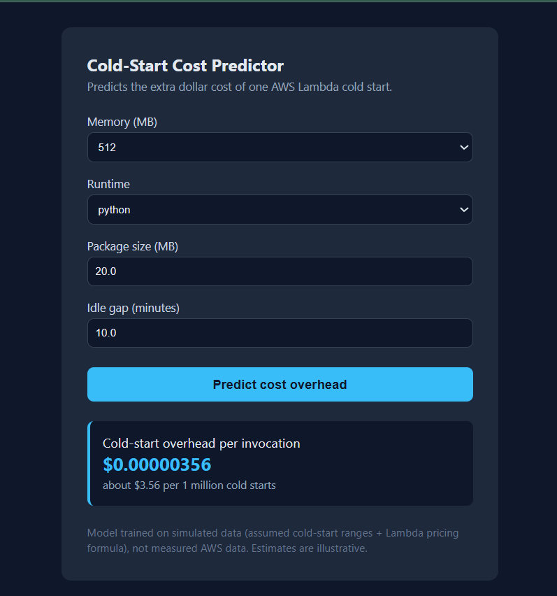

# Cold-Start Cost Predictor (AWS Lambda)

> Predict the **extra dollar cost** of a single AWS Lambda cold start, using only information available *before* the function runs.

A machine learning project that compares regression models (SLR, MLR, Ridge, Random Forest) for estimating cold-start cost overhead, and serves the best model through a small Django web app.


*Example prediction: 512 MB, Python, 20 MB package, 10 min idle gives about $0.00000356 per cold start (roughly $3.56 per 1 million cold starts).*

---

## The Problem

When an AWS Lambda function has been idle, AWS has to create a new execution environment before running the code. This is a **cold start** (the init phase). It adds latency and, because init time is billed as compute time, it adds cost.

This project predicts that extra cost from four inputs that are known before the invocation:

| Feature | Description |
|---|---|
| Memory (MB) | Memory allocated to the function (128 to 3008) |
| Runtime | `python`, `node` or `java` |
| Package size (MB) | Size of the deployment package (1 to 100) |
| Idle gap (minutes) | Time since the last invocation (0 to 60) |

**Target:** `cost_overhead_usd`, the dollar cost of the cold-start (init) portion only.

---

## Important Note About the Data

The dataset (1,500 rows) is **simulated**, not measured on AWS.

- Boot times are generated from assumed, realistic-looking ranges: a base time per runtime, plus time per MB of package, plus a small idle-gap effect, plus random noise, scaled down as memory increases.
- Time is converted to dollars with the Lambda pricing formula: `GB x seconds x price per GB-second` (x86 rate of $0.0000166667 used; check the current AWS Lambda pricing page).
- The idle-gap effect is an **assumption**, not a measured finding.

**Limitation:** a model trained on simulated data can only learn the patterns built into the generator. Results are illustrative and should not be read as real-world AWS behaviour.

**Future work:** replace the simulated data with real CloudWatch measurements (`Init Duration` and `Billed Duration`) from deployed Lambda functions.

---

## Method

1. Generate the synthetic dataset: `data/coldstart_data.csv`
2. Exploratory data analysis (target distribution, correlation heatmap)
3. Train and compare 5 models with an 80/20 train/test split and 5-fold cross-validation on the training set
4. Diagnostics: VIF (multicollinearity), residual plots, actual vs predicted
5. Save the best model: `models/model.pkl`
6. Serve predictions through a Django web form

---

## Results

RMSE and MAE are in **micro-dollars** (USD x 1,000,000) per cold start, which keeps the numbers readable.

| Model | CV R² | Test R² | Test RMSE | Test MAE |
|---|---|---|---|---|
| **Random Forest** | 0.9905 | 0.9904 | 0.948 | 0.632 |
| Multiple Linear Regression | 0.8277 | 0.8367 | 3.905 | 3.061 |
| Ridge | 0.8277 | 0.8365 | 3.906 | 3.052 |
| MLR (log target) | 0.8153 | 0.8330 | 3.948 | 2.702 |
| SLR (memory only) | 0.4972 | 0.5229 | 6.673 | 4.859 |

- **No multicollinearity:** VIF is about 1.0 for all numeric features.
- **Random Forest wins on this dataset** because cost = memory x duration is a non-linear relationship that a straight-line model cannot capture.
- **Caution:** the high R² mostly shows that the model recovered the rules built into the simulated data. It is not evidence about real AWS accuracy.

Plots and tables are in the [`reports/`](reports/) folder (`eda.png`, `residuals.png`, `model_comparison.png`, `results.csv`, `vif.csv`, `mlr_summary.txt`).

---

## Limitations

- Simulated data (see above).
- Predictions are only meaningful inside the training ranges: memory 128 to 3008 MB, package 1 to 100 MB, idle gap 0 to 60 min. Tree-based models cannot extrapolate beyond them.
- Only three runtimes and four features are modelled. Real cold starts also depend on VPC networking, architecture (x86 vs ARM), dependencies, provisioned concurrency and more.

---

## Quick Start

```bash
# 1. Clone and set up
git clone https://github.com/satyam528/coldstart-cost.git
cd coldstart-cost
python -m venv venv

# Windows
venv\Scripts\activate
# macOS / Linux
source venv/bin/activate

pip install -r requirements.txt

# 2. Generate the data and train the models
cd notebooks
python make_data.py
python train_model.py

# 3. Run the web app
cd ../app
python manage.py runserver
```

Then open **http://127.0.0.1:8000** in your browser, choose the inputs and click **Predict cost overhead**.

---

## Project Structure

```
coldstart-cost/
├── app/                  Django project (coldstart_site) and app (predictor)
├── data/                 coldstart_data.csv (simulated dataset)
├── docs/                 screenshot used in this README
├── models/               model.pkl, model_info.json
├── notebooks/            make_data.py, train_model.py
├── reports/              plots, results.csv, vif.csv, mlr_summary.txt
├── requirements.txt
└── README.md
```

## Tech Stack

Python, pandas, NumPy, scikit-learn, statsmodels, matplotlib, seaborn, joblib, Django.

## Author

Satyam, B.Tech CSE, Chandigarh Group of Colleges (CGC Jhanjeri).
GitHub: [satyam528](https://github.com/satyam528)